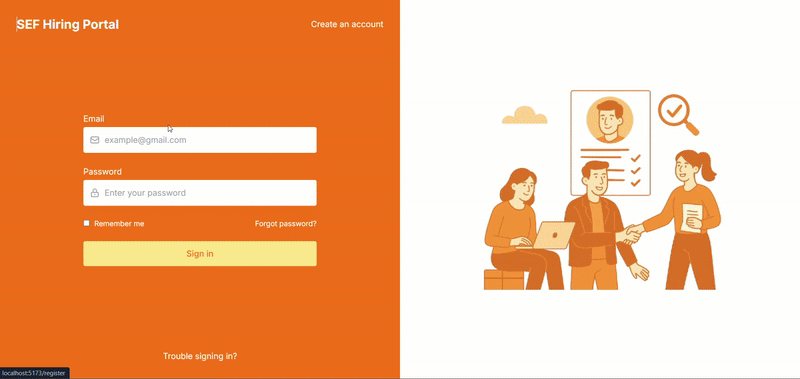
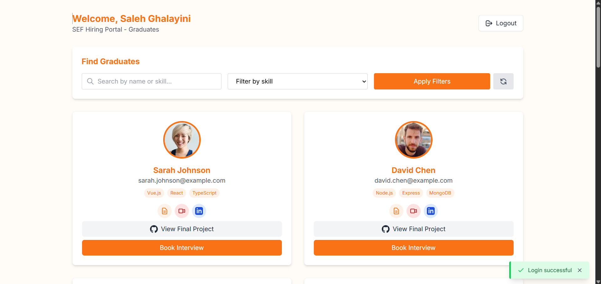
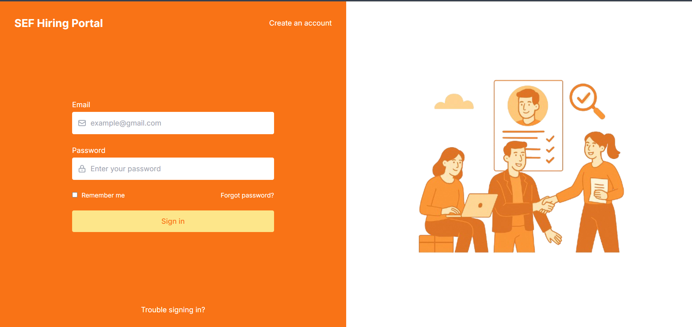
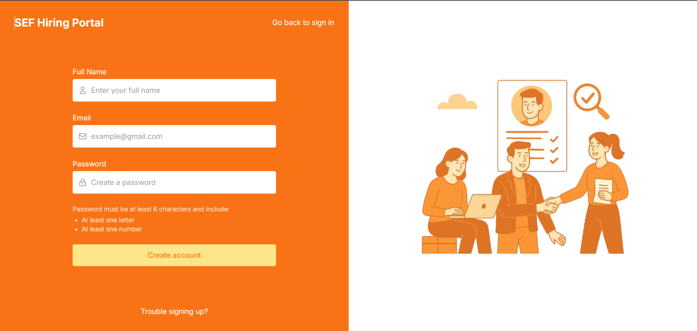
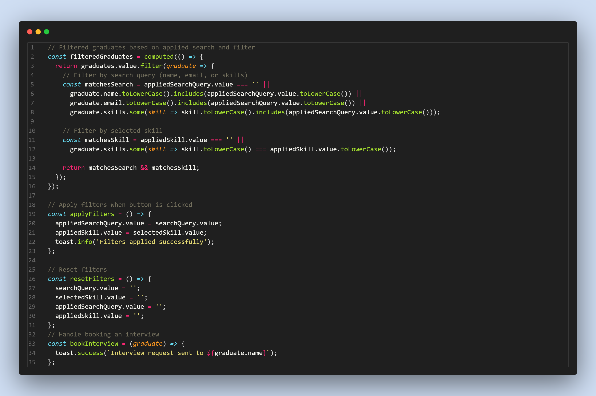
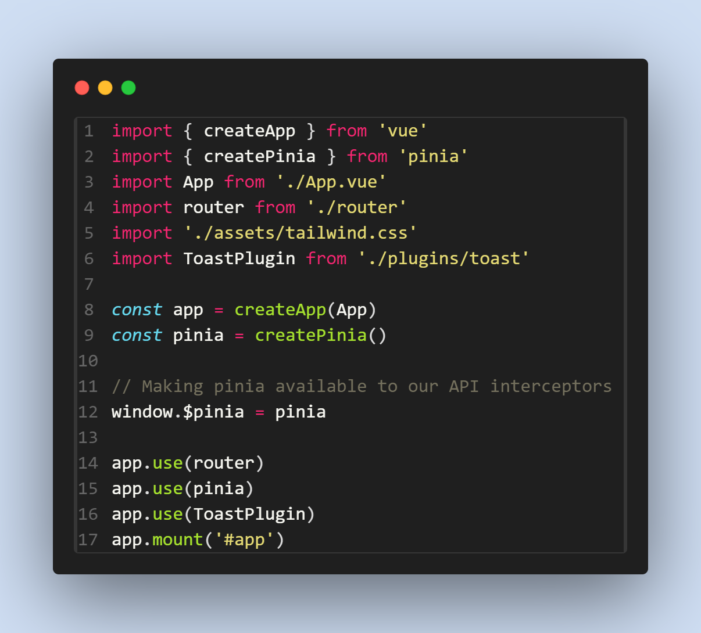

# 🌟 Vue-Prototype

## 🖼️ Overview

Vue-Prototype is a modern web application designed to showcase graduates' profiles, skills, and achievements. It features a clean and responsive design, intuitive navigation, and seamless integration with backend services. The project is built using cutting-edge technologies to deliver a fast and engaging user experience.

---

## ✨ Highlights

- 📱 **Responsive Design**: Optimized for all devices, including desktops, tablets, and mobile phones.
- 🎯 **Interactive Features**: Includes graduate profile cards, skill tags, and action buttons for viewing CVs, LinkedIn profiles, and GitHub repositories.
- 🎥 **Live Demo**: Experience the application in action with a GIF demonstration.
- 🔗 **Dynamic Data**: Powered by a robust backend with Laravel and MySQL.

---

## 🛠️ Tech Stack

### Frontend

- 🖥️ Vue.js
- 📦 Pinia (State Management)
- 🎨 Tailwind CSS
- ⚡ Vite (Build Tool)

### Backend

- 🛡️ Laravel (PHP Framework)
- 🗄️ MySQL (Database)
- ✅ PHPUnit (Testing)

### Other Tools

- 🖌️ PostCSS
- 🎼 Composer
- 📦 npm

---

## 🗂️ Folder Structure

```
Vue-Prototype/
├── client/
│   ├── src/
│   │   ├── assets/
│   │   ├── components/
│   │   ├── router/
│   │   ├── views/
│   │   └── main.js
│   ├── public/
│   ├── .env
│   ├── package.json
│   └── README.md
├── server/
│   ├── app/
│   ├── bootstrap/
│   ├── config/
│   ├── database/
│   │   ├── seeders/
│   ├── public/
│   ├── resources/
│   ├── .env
│   ├── composer.json
│   └── README.md
├── readme/
│   ├── code-snapshot.png
│   ├── Demo.gif
│   ├── home-page.png
│   ├── signin-page.png
│   ├── signup-page.png
└── README.md
```

---

## 🌟 Features

- 🧑‍🎓 **Graduate Profiles**: View detailed profiles with photos, skills, and links to CVs, LinkedIn, and GitHub.
- 🔍 **Search and Filter**: Easily find graduates based on skills and other criteria.
- 🎛️ **Interactive Buttons**: Book interviews, view final projects, and reset filters.
- 🚨 **Error Handling**: Displays error messages and loading states for better user experience.

---

## 🎥 Live Demo

<div style="text-align: center;">
  
</div>

---

## 📄 Pages

### 🏠 Home Page



### 🔑 Sign-In and Sign-Up Pages

<div style="display: flex; justify-content: space-between; align-items: center;">
  <div style="border: 2px solid white; padding: 10px; margin-right: 10px;">
    <h3 style="text-align: center;">Sign-In Page</h3>
    
  </div>
  <div style="border: 2px solid white; padding: 10px;">
    <h3 style="text-align: center;">Sign-Up Page</h3>
    
  </div>
</div>

---

## 📸 Code Snapshots

<div style="text-align: center;">
  <div style="border: 2px solid white; padding: 10px; margin-bottom: 20px;">
    <h3>useGraduate.js</h3>
    
  </div>
  <div style="border: 2px solid white; padding: 10px;">
    <h3>main.js</h3>
    
  </div>
</div>

---

## 🚀 How to Run

1. Clone the repository:
   ```bash
   git clone https://github.com/your-repo/vue-prototype.git
   ```
2. Navigate to the `client` folder and install dependencies:
   ```bash
   cd client
   npm install
   ```
3. Navigate to the `server` folder and install dependencies:
   ```bash
   cd ../server
   composer install
   ```
4. Set up the `.env` files for both client and server.
5. Start the development servers:
   - Client: `npm run dev`
   - Server: `php artisan serve`

---

## 🔮 Future Enhancements

- Add more filters for graduate search.
- Implement advanced analytics for graduate profiles.
- Enhance the UI with animations and transitions.

---

## 📜 License

This project is licensed under the MIT License.

---

## 🤝 Contributors

- **Saleh Ghalayini**

---

## 📧 Contact

For any inquiries or feedback, please contact [ghalayinisaleh9@gmail.com](mailto:ghalayinisaleh9@gmail.com).
